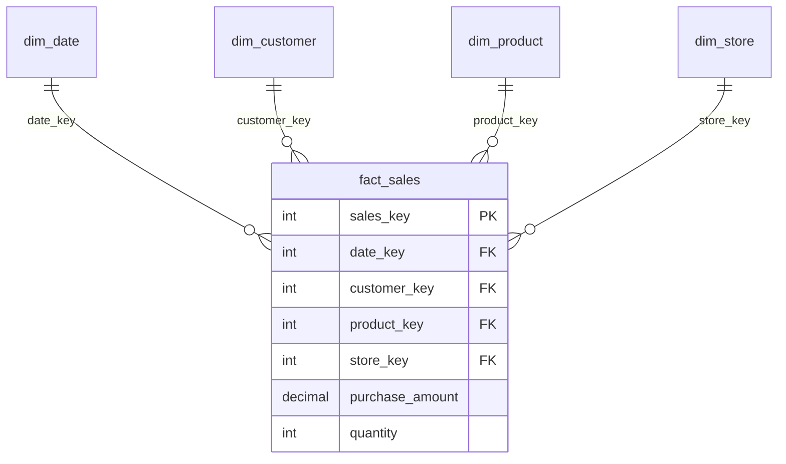

# Walmart Data Warehouse — HYBRIDJOIN ETL


A near-real-time data warehouse for Walmart-style retail data. Transactional records are streamed in, enriched on the fly with customer and product master data using a multi-threaded **HYBRIDJOIN** stream-relation join, and loaded into a **star-schema** warehouse in PostgreSQL. The warehouse then powers **20 OLAP queries** built with slicing, dicing, drill-down, `ROLLUP`, and materialized-view techniques.


---

## Highlights

- **HYBRIDJOIN algorithm** implemented from scratch in Python for efficient stream-relation joins against a large, disk-based relation.
- **Multi-threaded ETL** — one thread continuously feeds the stream buffer from `transactional_data.csv`, a second thread runs the join, mirroring true near-real-time ingestion.
- **Star-schema warehouse** — 4 dimension tables + 1 fact table, with indexes and a materialized view for fast analytics.
- **20 analytical queries** covering revenue trends, customer demographics, product affinity, seasonal analysis, and store/supplier performance.
- Automatic type sanitization (numpy/pandas → native Python) and graceful handling of unmatched tuples and bursty arrivals.

---

## How HYBRIDJOIN Works

HYBRIDJOIN joins a fast-arriving, potentially bursty stream `S` with a large, disk-resident relation `R` using four coordinated structures:

| Structure | Role |
|---|---|
| **Hash table (H)** | Multi-map holding stream tuples keyed by join attribute (10,000 slots). |
| **Queue** | Doubly-linked list tracking key arrival order (FIFO) for fair processing and O(1) random deletion. |
| **Disk buffer** | Holds one partition of `R` (500 tuples) loaded per iteration — the "join window." |
| **Stream buffer** | Absorbs incoming tuples during bursts so nothing is dropped. |

Each iteration loads up to `w` free slots' worth of stream tuples into the hash table, uses the oldest queued key to pull the relevant partition of `R`, probes the partition against the hash table, emits matches to the warehouse, and frees the matched slots back into `w`. Unmatched tuples persist until their partition is loaded.

---

## Star Schema



- **`fact_sales`** — grain: one row per matched transaction line; measures are `purchase_amount` and `quantity`.
- **`dim_date`** — full calendar attributes incl. weekday/weekend flag, quarter, and season (for seasonal drill-downs).
- **`dim_customer`** — gender, age group, occupation, city category, marital status.
- **`dim_product`** — multi-level product category, product name, supplier.
- **`dim_store`** — store name and location.
- Foreign-key indexes, composite indexes on common patterns, and a `STORE_QUARTERLY_SALES` view are created for query performance.

---

## Repository Structure

```
.
├── Create-DW.SQL        # Star-schema DDL: drops, tables, keys, indexes, view
├── Hybrid-Join.py       # Multi-threaded HYBRIDJOIN ETL implementation
├── Queries-DW.SQL       # 20 OLAP analytical queries
├── Project-Report.pdf   # Full report: design, algorithm, shortcomings, learnings
├── README.md
└── data/                # (not tracked — see "Data" below)
    ├── customer_master_data.csv
    ├── product_master_data.csv
    └── transactional_data.csv
```

---

## Getting Started

### Prerequisites

- PostgreSQL 12+
- Python 3.8+
- Python packages: `pandas`, `psycopg2-binary`

```bash
pip install pandas psycopg2-binary
```

### 1. Create the warehouse schema

```bash
createdb walmart_dw
psql -U postgres -d walmart_dw -f Create-DW.SQL
```

This drops any existing tables, then creates the four dimensions, the fact table, all keys/indexes, and the `STORE_QUARTERLY_SALES` view.

### 2. Run the HYBRIDJOIN ETL

```bash
python Hybrid-Join.py
```

The script prompts for database credentials and the three CSV paths at runtime:

```
Host (default: localhost): localhost
Port (default: 5432):      5432
Database name:             walmart_dw
Username:                  postgres
Password:                  ********

Customer master data file: data/customer_master_data.csv
Product master data file:  data/product_master_data.csv
Transaction data file:     data/transactional_data.csv
```

A producer thread streams transactions into the buffer while the join thread enriches and loads matched records, printing periodic progress and a final match-rate summary.

### 3. Run the OLAP queries

Open `Queries-DW.SQL` in psql or pgAdmin and run the queries individually to explore the results.

---

## Analytical Queries (Section 6)

<details>
<summary>Full list of the 20 OLAP queries</summary>

1. Top revenue-generating products, weekday vs. weekend, monthly drill-down
2. Customer demographics by purchase amount with city-category breakdown
3. Product-category sales by occupation
4. Total purchases by gender and age group, quarterly trend
5. Top occupations by product-category sales
6. City-category performance by marital status, monthly
7. Average purchase amount by stay duration and gender
8. Top 5 revenue cities by product category
9. Monthly sales growth by product category
10. Weekend vs. weekday sales by age group
11. Top revenue products, weekday/weekend, monthly drill-down (by year)
12. Store revenue growth rate, quarterly (2017)
13. Supplier sales contribution by store and product name
14. Seasonal product-sales analysis (dynamic drill-down)
15. Store- and supplier-wise monthly revenue volatility
16. Top 5 products purchased together (product-affinity analysis)
17. Yearly revenue trends by store, supplier, product with `ROLLUP`
18. Revenue and volume analysis per product for H1 vs. H2
19. Daily revenue spikes and outlier flagging
20. `STORE_QUARTERLY_SALES` view for optimized sales analysis

</details>

Together the queries demonstrate slicing, dicing, drill-down/roll-up, `ROLLUP` aggregation, window-based growth/volatility calculations, and a materialized view.

---

## Performance Notes

- Throughput ≈ 50–100 records/second (individual inserts with per-record commits).
- Hash table: 10,000 slots · disk partition: 500 tuples.
- Comfortable for small-to-medium datasets; the report discusses bulk inserts, dimension-key caching, and connection pooling as production improvements.

---

## Data

The three source CSVs (`customer_master_data.csv`, `product_master_data.csv`, `transactional_data.csv`) are course-provided and **not committed** to keep the repo lightweight and avoid redistributing dataset files. Place them in a `data/` folder before running, or point the script to their location when prompted. A small sample can be added if you'd like the repo to run end-to-end out of the box.

---

## Author

**Muhammad Ahmad** — BS Data Science, FAST NUCES
[LinkedIn](https://www.linkedin.com/in/mmuhammadahmad/)

*Academic project — shared for portfolio purposes.*
